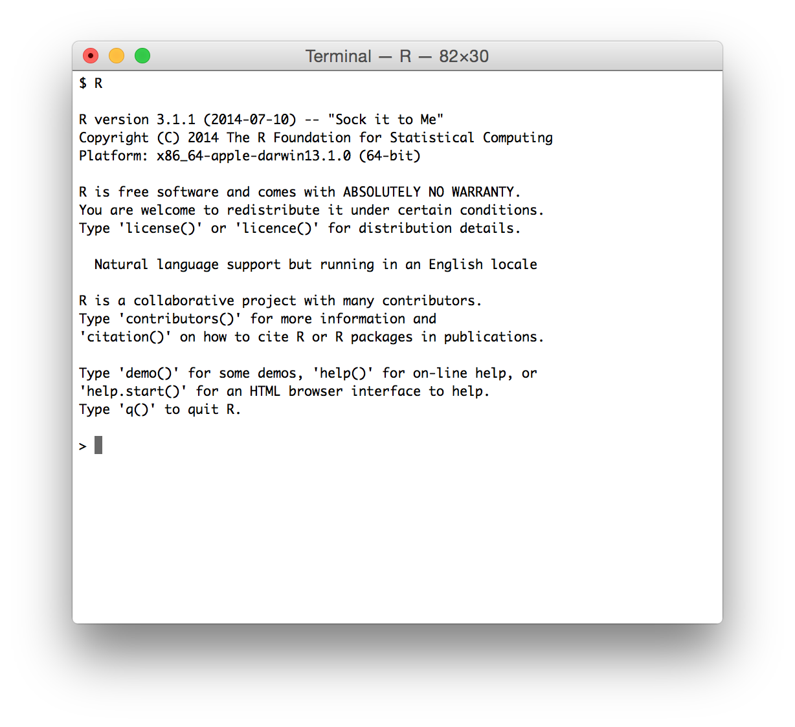
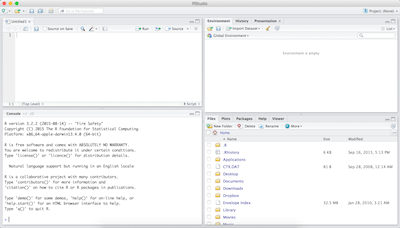

# Reproduciblility toolkit

## R + RStudio

<div class="columns-2">


</div>


## Why R?

<div class="columns-2">
- Programming language for data analysis
- Free!
- Open source
- Widely used and supported across all disciplines
- Can be used on Windows, Mac OS X, or Linux


</div>


## Why not language X?

- There are a number of other great programming tools out there that can also be
used to improve the reproducibility of your analysis

- The key is to use some type of language that will allow you to automate and
document your analysis

- Once you master one language you'll probably find it easier to learn another


## Once in R

You could just type into the command prompt...

- ... but that doesn't help much with documentation

- ... but that doesn't help much with automation


## A better solution

With RStudio you can combine your programming and your documentation

<div class="columns-2">
- RStudio gives you a single environment to combine your documentation and your
analysis
- It runs on top of R
- Gives you a bunch of really cool features that we'll explore throughout the
workshop


</div>

## Anatomy of RStudio

<div class="columns-2">
- Left: Console
    - Text on top at launch: version of R that you’re running
    - Below that is the prompt
- Upper right: Workspace and command history
- Lower right: Plots, access to files, help, packages, data viewer


</div>

## R Packages

- Packages are the fundamental units of reproducible R code. They include reusable R
functions, the documentation that describes how to use them, and (often) sample data.
(From: http://r-pkgs.had.co.nz)

- We will use the `ggplot2` package for plots and `dplyr` for data wrangling in this
session.

- If you have not yet done so, install these packages by running the following
in the Console:
```{r eval=FALSE}
install.packages("ggplot2")
install.packages("dplyr")
```

- This is just one way of installing a package, there is also a GUI approach in
the Packages pane

# Demo

## Goals of the demo

- Demonstrate "good practice" for organizing data files and analysis
documents (R Markdown)
- How to read data from a file
- How to manipulate the data, and document it in a reproducible way
    - How easy it would be to revert any changes if need be
- How to subset data
- How to make simple plots in ggplot

**NOT** about understanding all the R commands, but **rather** getting the big
picture of how using R in this way facilitates reproducible analyses

## R Markdown demo

- Open `intro-template.Rmd`

- Click on *Knit HTML* to compile the document

- Important features:
    - YAML on top
    - Code in chunks
    - R Markdown syntax
        - Human readable!
        - Limited, so not too time consuming to master
    - Self contained workspace

## Extending the analysis

Great news!? We just received some more data, in bits and pieces of course:

- `gapminder-7080.csv`
- `gapminder-90plus.csv`

Let's walk through generation of new plots for the 1970s and 1980s and 1990s plus (these new analyses are already in the `intro-tutorial.Rmd` document).

Note that all code required to accomplish these tasks is also in the template.
You do not need to come up with the R code, **knit** the document to combine
the datasets and you'll see that the code required for recreating the plots
is the same as above. That's the beauty of R Markdown!


## Take aways

- The analysis is self-documenting
- It's easy to extend or refine analyses by copying and modifying code blocks
- The results of the analysis can be disseminated by sending R Markdown and
providing data sources, or just simply providing the generated HTML of just
a summary of the analysis is needed

# Reproducibility checklist

## Reproducibility checklist

- Serves as a tool to help you think about the reproducibility of your data
analysis.
- Many of the questions can be thought of as having a yes/no answer.
- A better approach would be to see the questions as being open ended with
the real question being, "What can I do to improve the status of my project
on this bullet point?"
- With that in mind, you'll never get 100% of the bullets right for your project,
but you'll always be improving.

